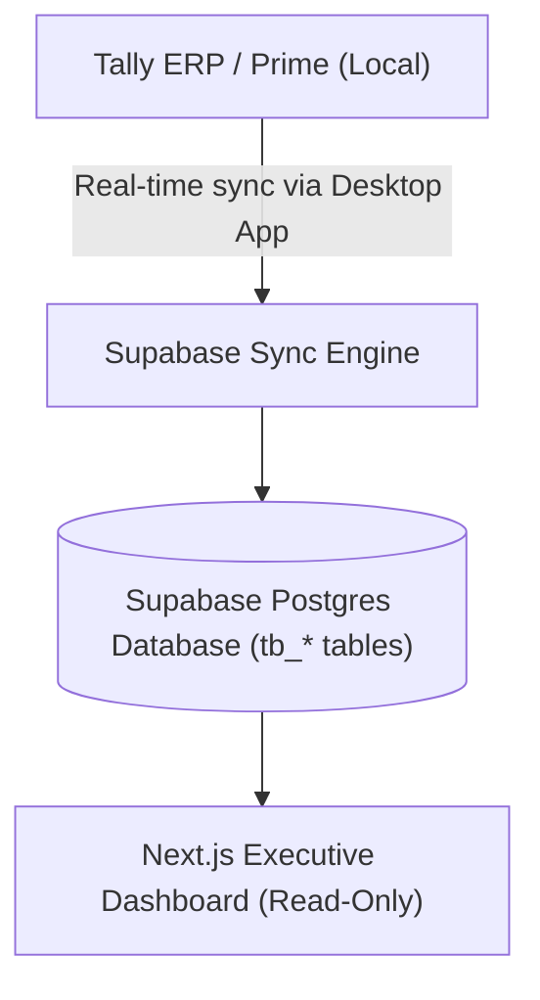
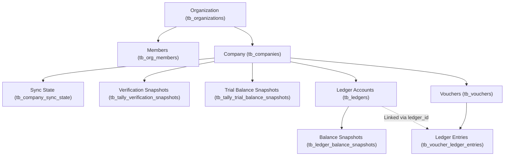

# TallyBridge Database Architecture & Data Structure

This document provides a comprehensive reference of the TallyBridge data model, entity hierarchies, table schemas, and business logic. It serves as a persistent guide for understanding how data flows from a local Tally instance into the Supabase database, and how the Next.js Executive Dashboard aggregates and calculates accounting reports.

---

## 1. System Overview



---

## 2. Entity Hierarchy (The Data Tree)

The relationship hierarchy of the database flows from high-level multi-tenant structures down to granular transaction ledger entries:



### Hierarchy Breakdown:
1. **Organization (`tb_organizations`)**: The top-level tenant.
2. **Company (`tb_companies`)**: Multiple Tally companies can exist under a single Organization.
3. **Ledger Accounts (`tb_ledgers`)**: Financial account heads (e.g., "HDFC Bank", "Cash", "Sales A/c", "Sundry Debtors").
   * **Ledger Hierarchy**: Ledgers are categorized under groups using the `parent_name` column (e.g., "Bank Accounts", "Cash-in-hand", "Indirect Expenses").
4. **Vouchers (`tb_vouchers`)**: Header records for accounting transactions (e.g., Payments, Receipts, Contra entries, Journal entries, Sales, Purchases).
5. **Ledger Entries (`tb_voucher_ledger_entries`)**: Individual debit and credit rows inside a voucher. Every voucher contains at least two ledger entry lines (double-entry accounting).

---

## 3. Database Schema Reference

All tables are prefixed with `tb_` to separate TallyBridge database assets from other applications.

### 3.1. Tenant & Identity Tables

#### `tb_organizations`
Holds top-level organizations.
| Column | Type | Nullable | Description |
| :--- | :--- | :--- | :--- |
| `id` | `uuid` | No | Primary Key. Unique identifier of the organization. |
| `name` | `text` | No | Display name of the organization. |
| `created_at` | `timestamptz`| No | Timestamp of record creation. |

#### `tb_org_members`
Maps users to organizations.
| Column | Type | Nullable | Description |
| :--- | :--- | :--- | :--- |
| `user_id` | `uuid` | No | Foreign key pointing to auth user. |
| `org_id` | `uuid` | No | Foreign key pointing to `tb_organizations(id)`. |
| `role` | `text` | No | Member role (e.g., administrator, viewer). |
| `created_at` | `timestamptz`| No | Timestamp of assignment. |

---

### 3.2. Accounting Core Tables

#### `tb_companies`
The business entities being monitored.
| Column | Type | Nullable | Description |
| :--- | :--- | :--- | :--- |
| `id` | `uuid` | No | Primary Key. Unique identifier of the company. |
| `org_id` | `uuid` | No | Foreign key pointing to `tb_organizations(id)`. |
| `name` | `text` | No | Name of the company as registered in Tally. |
| `tally_company_guid` | `text` | No | The unique UUID generated by Tally for this company. |
| `last_successful_sync_at` | `timestamptz` | Yes | Timestamp of the last fully completed sync. |
| `last_sync_status` | `text` | Yes | Status of the latest sync attempt (`synced`, `error`, etc.). |
| `last_sync_error` | `text` | Yes | Error message if the sync failed. |
| `is_active` | `boolean` | No | Flag indicating if this company is active. Default `true`. |
| `updated_at` | `timestamptz`| No | Last modification timestamp. |

#### `tb_ledgers`
Account masters exported from Tally.
| Column | Type | Nullable | Description |
| :--- | :--- | :--- | :--- |
| `id` | `uuid` | No | Primary Key. Unique identifier of the ledger account. |
| `org_id` | `uuid` | No | Foreign key pointing to `tb_organizations(id)`. |
| `company_id` | `uuid` | No | Foreign key pointing to `tb_companies(id)`. |
| `name` | `text` | No | Name of the ledger (e.g., "State Bank of India"). |
| `parent_name` | `text` | Yes | Parent group name (e.g., "Bank Accounts", "Sundry Debtors"). |
| `opening_balance` | `numeric` | Yes | Initial balance at the start of sync. |
| `closing_balance` | `numeric` | Yes | Current cumulative balance (synced master value). |
| `is_deleted` | `boolean` | No | Soft-delete flag. |

#### `tb_ledger_balance_snapshots`
Immutable historical baselines for each ledger at specific dates, allowing accurate historical reports.
| Column | Type | Nullable | Description |
| :--- | :--- | :--- | :--- |
| `ledger_id` | `uuid` | No | Composite Primary Key (Part 1). References `tb_ledgers(id)`. |
| `balance_date` | `date` | No | Composite Primary Key (Part 2). Baseline date (usually `as_of_date`). |
| `company_id` | `uuid` | No | References `tb_companies(id)`. |
| `org_id` | `uuid` | No | References `tb_organizations(id)`. |
| `opening_balance` | `numeric` | No | The verified starting balance immediately before this date. |
| `created_at` / `updated_at` | `timestamptz` | No | Auditing timestamps. |

#### `tb_vouchers`
The transaction headers.
| Column | Type | Nullable | Description |
| :--- | :--- | :--- | :--- |
| `id` | `uuid` | No | Primary Key. Unique identifier of the voucher. |
| `company_id` | `uuid` | No | References `tb_companies(id)`. |
| `voucher_date` | `date` | No | The transaction posting date. |
| `voucher_type` | `text` | No | Transaction type (e.g., `Receipt`, `Payment`, `Contra`, `Journal`, `Sales`). |
| `voucher_number` | `text` | Yes | String representation of the voucher sequence number from Tally. |
| `party_ledger_name` | `text` | Yes | Name of the primary counterparty ledger. |
| `narration` | `text` | Yes | General notes / remarks entered on the voucher in Tally. |
| `is_cancelled` | `boolean` | No | Flag indicating if this voucher was cancelled. |
| `is_optional` | `boolean` | No | Flag indicating if this is an optional voucher. |
| `is_deleted` | `boolean` | No | Soft-delete flag. |

#### `tb_voucher_ledger_entries`
Individual transaction ledger breakdowns (the credit/debit lines).
| Column | Type | Nullable | Description |
| :--- | :--- | :--- | :--- |
| `id` | `uuid` | No | Primary Key. |
| `voucher_id` | `uuid` | No | References parent `tb_vouchers(id)`. |
| `company_id` | `uuid` | No | References `tb_companies(id)`. |
| `ledger_id` | `uuid` | Yes | References `tb_ledgers(id)`. Null if ledger wasn't synchronized yet. |
| `ledger_name` | `text` | No | Name of the ledger involved in this entry. |
| `amount` | `numeric` | No | Signed transaction amount (Credits are positive; Debits are negative). |
| `is_deemed_positive` | `boolean` | Yes | Boolean representation of entry direction from Tally. |
| `line_number` | `integer` | No | Position of entry inside the voucher (used for sorting and running balance order). |

---

### 3.3. Sync State & Snapshots

#### `tb_company_sync_state`
Reconciliation and synchronization coverage boundaries.
| Column | Type | Nullable | Description |
| :--- | :--- | :--- | :--- |
| `company_id` | `uuid` | No | Primary Key. References `tb_companies(id)`. |
| `last_ledger_sync_at` | `timestamptz` | Yes | Timestamp of last ledger syncing. |
| `last_voucher_sync_at` | `timestamptz` | Yes | Timestamp of last voucher syncing. |
| `history_baseline_date` | `date` | Yes | The date from which verified historical calculations can begin. |
| `history_reconciliation_status` | `text` | Yes | Verification status of synced data (`complete` or pending). |
| `last_error` | `text` | Yes | Details on errors if synchronization failed. |

#### `tb_tally_verification_snapshots`
Individual ledger balances fetched directly from Tally's Trial Balance at specific dates, used to run assertions against calculated local ledger balances.
| Column | Type | Nullable | Description |
| :--- | :--- | :--- | :--- |
| `id` | `uuid` | No | Primary Key. |
| `org_id` | `uuid` | No | References `tb_organizations(id)`. |
| `company_id` | `uuid` | No | References `tb_companies(id)`. |
| `ledger_id` | `uuid` | No | References `tb_ledgers(id)`. |
| `as_of_date` | `date` | No | Date of the snapshot. |
| `closing_balance` | `numeric` | No | Expected balance according to Tally. |

---

## 4. Database Views

### `tb_ledger_voucher_lines`
A critical database view that formats entries for detail grids and calculates a chronological running balance for ledger accounts.
```sql
select 
  e.company_id,
  l.id as ledger_id,
  l.name as ledger_name,
  e.id as voucher_ledger_entry_id,
  e.line_number,
  v.id as voucher_id,
  v.voucher_date,
  v.voucher_type,
  v.voucher_number,
  coalesce(other_entries.particulars, v.party_ledger_name, v.narration, '') as particulars,
  case when e.amount < 0 then abs(e.amount) else 0::numeric end as debit_amount,
  case when e.amount >= 0 then abs(e.amount) else 0::numeric end as credit_amount,
  -- Dynamic running balance calculation
  coalesce(snapshot.opening_balance, 0::numeric) + coalesce((
    select sum(previous_entry.amount)
    from public.tb_voucher_ledger_entries previous_entry
    join public.tb_vouchers previous_voucher on previous_voucher.id = previous_entry.voucher_id
    where previous_entry.ledger_id = e.ledger_id
      and previous_entry.company_id = e.company_id
      and public.tb_voucher_affects_books(previous_voucher)
      and previous_voucher.voucher_date >= snapshot.as_of_date
      and (previous_voucher.voucher_date, coalesce(previous_voucher.voucher_number, ''), previous_entry.line_number, previous_voucher.id)
        <= (v.voucher_date, coalesce(v.voucher_number, ''), e.line_number, v.id)
  ), 0::numeric) as running_balance
from public.tb_voucher_ledger_entries e
join public.tb_vouchers v on v.id = e.voucher_id
...
```

---

## 5. Core Accounting Logic & Calculations

### 5.1. Voucher Book Eligibility
Tally allows optional or order vouchers which do not post to the financial books. In our database, these are excluded from financial calculations by calling `tb_voucher_affects_books(voucher)`:
* **Excluded Vouchers**:
  * `is_cancelled = true`
  * `is_deleted = true`
  * `is_optional = true`
  * `voucher_type` is like `'Purchase Order'` or `'Sales Order'`

### 5.2. Debit vs. Credit Semantics
Ledger entry values (`amount`) use a simple **signed model**:
* **Credit**: Positive values (`amount >= 0`). Represents cash/equity inflow, liability increase, or revenue/income.
* **Debit**: Negative values (`amount < 0`). Represents cash outflow, asset increase, or expense.

When formatting for UI display, we separate these into absolute debit and credit values:
$$\text{Debit Amount} = \begin{cases} \text{abs}(amount) & \text{if } amount < 0 \\ 0 & \text{otherwise} \end{cases}$$
$$\text{Credit Amount} = \begin{cases} amount & \text{if } amount \ge 0 \\ 0 & \text{otherwise} \end{cases}$$

### 5.3. Trial Balance Calculation
The Trial Balance calculates the closing balance of all ledgers as of a specific date using:
1. The closest preceding historical baseline snapshot (`tb_ledger_balance_snapshots.opening_balance`).
2. The sum of all voucher entry amounts between that snapshot's baseline date and the targeted `as_of_date`.

$$\text{Closing Balance} = \text{Snapshot Opening Balance} + \sum_{t=\text{Snapshot Date}}^{\text{As Of Date}} \text{Entry Amount}$$

#### Debit/Credit Balance Rules:
* If the final cumulative $\text{Closing Balance}$ is **negative**, the ledger has a **Debit Balance**:
  $$\text{Debit Balance} = \text{abs}(\text{Closing Balance})$$
  $$\text{Credit Balance} = 0$$
* If the final cumulative $\text{Closing Balance}$ is **positive**, the ledger has a **Credit Balance**:
  $$\text{Debit Balance} = 0$$
  $$\text{Credit Balance} = \text{Closing Balance}$$

---

## 6. How it Maps to Reports

* **Trial Balance Screen**: Queries `tb_trial_balance(company_id, null, date)`. It aggregates matching rows under parent headers (`parent_name`) like *Sundry Debtors*, *Bank Accounts*, *Fixed Assets*, etc., and displays their calculated Debit/Credit totals.
* **Ledger Detail Screen**: Queries the view `tb_ledger_voucher_lines` filtered by `company_id` and `ledger_id`. It lists each transaction line chronologically with columns for `particulars`, `debit_amount`, `credit_amount`, and the dynamically calculated `running_balance`.
* **Management Reports (Future / Funds Utilization)**:
  * Uses voucher transaction details (filtering `tb_vouchers` where `voucher_type` is `Payment` or `Receipt`).
  * Traces movements between cash/bank ledger groups and revenue/capital expense groups.
