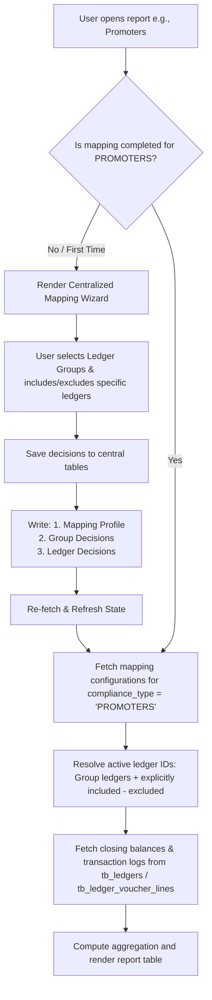

# Centralized Report Mapping Framework: Architecture & Technical Plan

This document defines the system architecture, database schema, and operational data flow for our **Tally Reporting SaaS platform**. The framework allows our team to launch new reports (e.g., Promoters, GST, Loans) dynamically without needing new database tables, migrations, or custom API endpoints.

---

## 1. System Data Flow Diagram

The following chart illustrates the decision tree and execution steps when a user requests a mapped report:



---

## 2. Centralized Database Schema

We use three core tables to map *all* report types. We filter decisions using the **`compliance_type`** column (e.g., `'TDS'`, `'PROMOTERS'`, `'GST'`, `'LOANS'`).

### Table 1: `compliance_mapping_profiles`
Acts as the header record tracking configuration status for a given company and report type.

* **Schema:**
  * `id` (UUID, Primary Key)
  * `org_id` (UUID, Foreign Key)
  * `company_id` (UUID, Foreign Key)
  * `compliance_type` (TEXT - `'TDS'`, `'PROMOTERS'`, `'GST'`, `'LOANS'`)
  * `status` (TEXT - `'draft'`, `'complete'`)
  * `confirmed_by` (UUID, User reference)
  * `confirmed_at` (TIMESTAMPTZ)

* **Concrete Database Example Rows:**
  | id (UUID) | org_id (UUID) | company_id (UUID) | compliance_type | status | confirmed_at |
  | :--- | :--- | :--- | :--- | :--- | :--- |
  | `p1-uuid` | `org-123` | `comp-456` | **`'TDS'`** | `complete` | `2026-08-19 10:00:00` |
  | `p2-uuid` | `org-123` | `comp-456` | **`'PROMOTERS'`** | `complete` | `2026-08-21 14:30:00` |
  | `p3-uuid` | `org-123` | `comp-456` | **`'GST'`** | `draft` | *NULL* |

---

### Table 2: `compliance_group_decisions`
Stores which Tally parent ledger groups are selected to be pulled into a report.

* **Schema:**
  * `id` (UUID, Primary Key)
  * `profile_id` (UUID, Foreign Key referencing profile)
  * `org_id` (UUID)
  * `company_id` (UUID)
  * `compliance_type` (TEXT)
  * `group_name` (TEXT - Tally parent group name)
  * `selected` (BOOLEAN)

* **Concrete Database Example Rows:**
  | id (UUID) | profile_id (UUID) | compliance_type | group_name | selected |
  | :--- | :--- | :--- | :--- | :--- |
  | `gd1` | `p1-uuid` | **`'TDS'`** | `"Duties & Taxes"` | `true` |
  | `gd2` | `p1-uuid` | **`'TDS'`** | `"TDS Payable"` | `true` |
  | `gd3` | `p2-uuid` | **`'PROMOTERS'`** | `"Unsecured Loans"` | `true` |
  | `gd4` | `p2-uuid` | **`'PROMOTERS'`** | `"Capital Account"` | `true` |

---

### Table 3: `compliance_ledger_decisions`
Tracks exceptions and classifications for specific ledgers. Used when a user selects a subgroup but wants to explicitly include/exclude/categorize particular ledgers.

* **Schema:**
  * `id` (UUID, Primary Key)
  * `profile_id` (UUID, Foreign Key referencing profile)
  * `org_id` (UUID)
  * `company_id` (UUID)
  * `compliance_type` (TEXT)
  * `ledger_id` (UUID, Foreign Key referencing ledger)
  * `selected` (BOOLEAN - `true` to force include, `false` to explicitly exclude)
  * `category` (TEXT - `'PAYABLE'`, `'RECEIVABLE'`, `'INTEREST'`, `'OTHER'`)
  * `confirmed_by` (UUID)

* **Concrete Database Example Rows:**
  | id (UUID) | profile_id (UUID) | compliance_type | ledger_id (UUID) | selected | category | confirmed_by |
  | :--- | :--- | :--- | :--- | :--- | :--- | :--- |
  | `ld1` | `p1-uuid` | **`'TDS'`** | `ledg-99` | `true` | `'PAYABLE'` | `user-999` |
  | `ld2` | `p1-uuid` | **`'TDS'`** | `ledg-88` | `false` | *NULL* (Excluded) | `user-999` |
  | `ld3` | `p2-uuid` | **`'PROMOTERS'`** | `ledg-77` | `true` | `'OTHER'` | `user-999` |
  | `ld4` | `p2-uuid` | **`'PROMOTERS'`** | `ledg-66` | `false` | *NULL* (Excluded) | `user-999` |

---

## 3. How It Works: Step-by-Step

### Phase A: Setup Mapping Flow (Write)
1. When a report is not mapped, the UI displays all ledger groups (`tb_ledger_groups`) with checkbox inputs.
2. The user checks the groups they want (e.g., "Unsecured Loans"). Checking a group displays all its child ledgers.
3. The user toggles ledgers. Deselecting a ledger sets `selected = false` in `compliance_ledger_decisions`.
4. Click **Confirm** calls a Next.js Server Action that batch inserts/upserts these selections into the 3 tables under the selected `compliance_type`.

### Phase B: Report Aggregation Flow (Read)
When rendering the report, the server-side data fetcher executes the following logic:
1. **Load Decisions:** Query the mapped groups (`compliance_group_decisions`) and ledger overrides (`compliance_ledger_decisions`) matching `compliance_type`.
2. **Resolve Active Ledger IDs:**
   - Find all ledgers in `tb_ledgers` whose parent group matches any mapped group.
   - **Subtract** ledgers explicitly deselected (`selected = false` in `compliance_ledger_decisions`).
   - **Add** ledgers explicitly selected (`selected = true` in `compliance_ledger_decisions`).
3. **Query Financials:** Query `tb_ledgers` and `tb_ledger_voucher_lines` filtering by the resolved active ledger IDs.
4. **Group and Subtotal:** Group the balances by parent group name, calculate subgroup subtotals, and sum them to produce the Grand Total.

---

## 4. Reusable Frontend Architecture

To launch another report, we only need to pass a different configuration structure to our unified `ReportMappingWizard` component:

```tsx
// Example definition for the Promoters Report
const PromotersConfig = {
  complianceType: 'PROMOTERS',
  title: 'Promoters Mapping',
  description: 'Identify the groups and ledgers representing promoters capital and unsecured loans.',
  autoSuggestGroup: (name) => name.toLowerCase().includes('unsecured') || name.toLowerCase().includes('promoter'),
  defaultCategory: 'OTHER'
}
```

This ensures full UI reusability and keeps our frontend codebase clean and dry.
