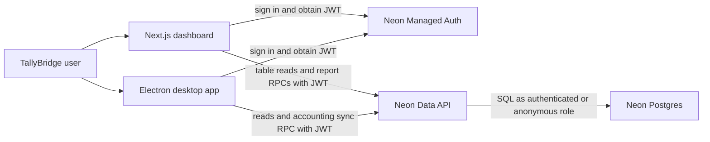
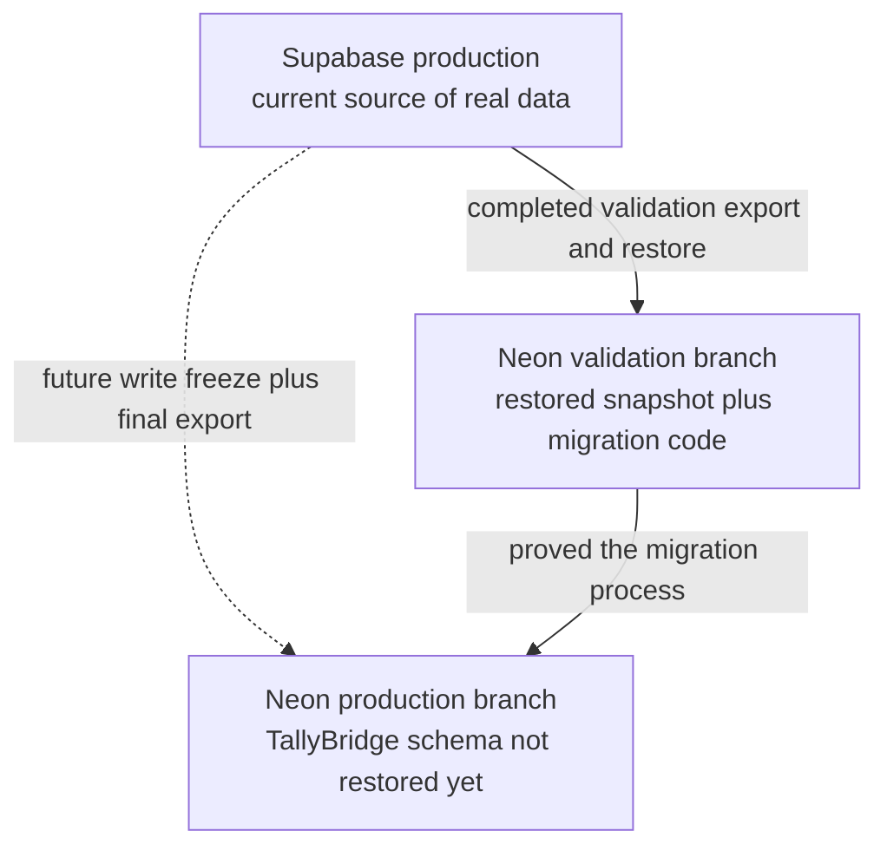
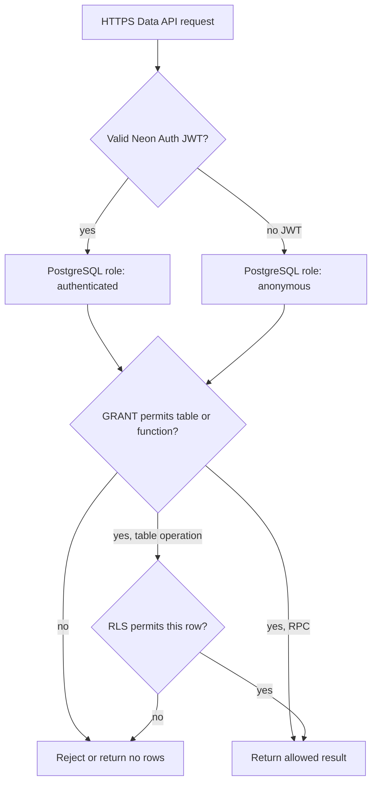
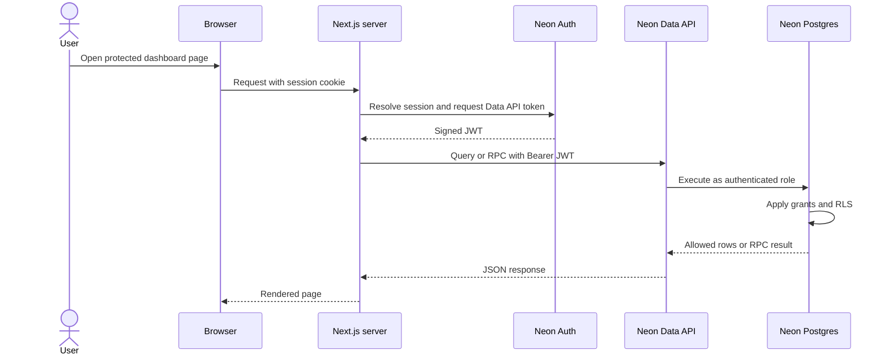
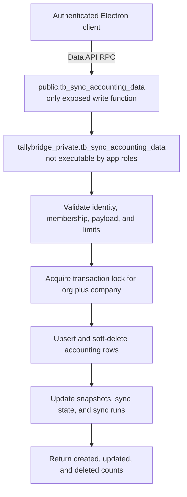
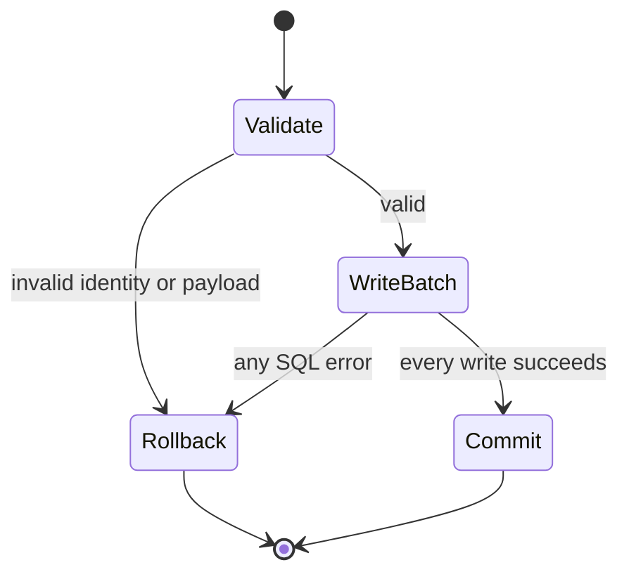
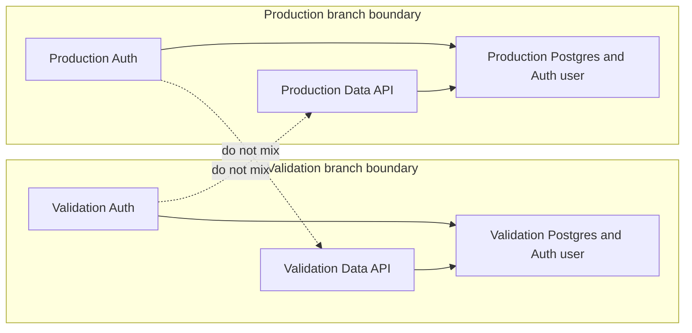
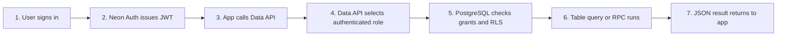

# TallyBridge Supabase-to-Neon migration guide

Last verified: **August 22, 2026**

This document explains the TallyBridge migration from first principles. It is both:

- a record of what was implemented and tested; and
- a beginner-friendly explanation of how Neon Auth, the Neon Data API, PostgreSQL permissions, row-level security, and database RPCs now connect the dashboard and Electron application.

It does **not** claim that production has been cut over. The restored data and completed implementation currently live on the temporary Neon validation branch. The Neon production branch is still empty of TallyBridge tables.

## 1. Executive summary

TallyBridge used Supabase as a combined Postgres, Auth, REST API, and Edge Function platform. The migration keeps PostgreSQL as the database but replaces the platform-specific pieces:

| Concern | Before: Supabase | After: Neon implementation |
| --- | --- | --- |
| Relational database | Supabase Postgres | Neon Postgres |
| User authentication | Supabase Auth | Neon Managed Auth |
| Browser/app database API | Supabase PostgREST API | Neon Data API, which is PostgREST-compatible |
| User identity table | `auth.users` | `neon_auth."user"` |
| User identity inside SQL | `auth.uid()` supplied by Supabase | `auth.uid()` supplied from the Neon Auth JWT |
| Dashboard reads | Supabase client queries and RPCs | Neon JS client queries and RPCs through the Data API |
| Electron accounting writes | Supabase Edge Function | One authenticated Neon Data API RPC |
| Serverless/Vercel sync function | Previously part of the proposed design | **Not used** |
| Tenant isolation | PostgreSQL grants and RLS | PostgreSQL grants and translated RLS |

The final runtime architecture is:



There is deliberately no application-owned proxy between Electron and Neon. Electron never receives a database connection string or database password. It receives only the client-safe Auth and Data API HTTPS endpoints, signs in, and sends a short-lived JWT with Data API requests.

## 2. Current state: completed versus not yet cut over

### Completed on the validation branch

The implementation and restored data are on:

| Item | Value |
| --- | --- |
| Neon project | `Tally` (`dark-haze-71431434`) |
| Validation branch | `direct-data-api-rpc-validation-20260821` (`br-dark-mode-azfjigx7`) |
| Branch state on August 22 | Ready |
| Current expiry reported by Neon | August 28, 2026 at 12:30 UTC |
| Data API | `https://ep-red-cell-az679t4a.apirest.c-3.ap-southeast-1.aws.neon.tech/neondb/rest/v1` |
| Managed Auth | `https://ep-red-cell-az679t4a.neonauth.c-3.ap-southeast-1.aws.neon.tech/neondb/auth` |

On that branch we completed:

1. selective export of the 16 application tables from Supabase;
2. schema and data restore into Neon;
3. translation of Supabase-specific Auth foreign keys, roles, grants, and RLS policies;
4. recreation of reporting functions and the security-invoker ledger view;
5. creation of the direct accounting sync RPC;
6. creation of the designated Neon Managed Auth owner identity and remapping of the `TallyBridge Demo Org` owner membership;
7. dashboard conversion to Neon Auth and the Neon Data API;
8. Electron conversion to Neon Auth and direct Data API reads/RPCs;
9. migration verification, builds, tests, and a live Auth/Data API smoke test.

### Not completed: production cutover

The production branch is:

| Item | Value |
| --- | --- |
| Production branch | `production` (`br-dry-heart-azz7ln2y`) |
| Data API | `https://ep-shiny-poetry-az38gwc1.apirest.c-3.ap-southeast-1.aws.neon.tech/neondb/rest/v1` |
| Managed Auth | `https://ep-shiny-poetry-az38gwc1.neonauth.c-3.ap-southeast-1.aws.neon.tech/neondb/auth` |

A read-only check on August 22 confirmed that `public.tb_organizations` does not exist on production. Therefore:

- do not point a production release at those production endpoints yet;
- the production Auth user and membership must be created/remapped in the production branch during cutover;
- the final Supabase write freeze, export, production restore, verification, and controlled first sync still need to be performed.



Neon branches are isolated copy-on-write database environments. Enabling or populating a feature branch does not populate production, and each branch has its own Data API and Auth configuration. See [Neon branching](https://neon.com/docs/introduction/branching) and [branching with Neon Auth](https://neon.com/docs/auth/branching-authentication).

## 3. The foundational concepts

### 3.1 PostgreSQL is the database; Neon is the platform around it

PostgreSQL stores tables, rows, indexes, constraints, views, and functions. Neon hosts PostgreSQL and adds services such as branching, Managed Auth, and the HTTPS Data API.

The database connection string is the administrative path used by migration tooling such as `pg_dump`, `pg_restore`, and `psql`. It is powerful and secret. It must never be shipped inside Electron or exposed to a browser.

The Data API is the application path. It accepts HTTPS requests, validates a JWT, maps the request to a database role, and runs the corresponding query under PostgreSQL permissions and RLS. It is stateless and PostgREST-compatible. See the [Neon Data API overview](https://neon.com/docs/data-api/overview).

### 3.2 Authentication and authorization are different

**Authentication** answers: “Who is this user?”

Neon Managed Auth checks the email and password, maintains the session, and issues a signed JWT. The JWT contains a `sub` subject claim identifying the user.

**Authorization** answers: “What may this user do?”

The Data API validates the JWT and presents the request to PostgreSQL as the `authenticated` role. PostgreSQL then applies:

1. schema and table/function grants;
2. row-level security policies for individual rows; and
3. application checks inside RPC functions.

An anonymous request is mapped to the `anonymous` role. TallyBridge revokes that role's access.



This layered model is important: enabling the Data API does **not** make every table public. The [Data API access-control documentation](https://neon.com/docs/data-api/access-control) describes the JWT, database-role, grant, and RLS flow.

### 3.3 What `auth.uid()` means

For an authenticated Data API request, Neon makes the JWT claims available to PostgreSQL. `auth.uid()` reads the JWT subject as a UUID. TallyBridge stores that UUID in `tb_org_members.user_id`.

The membership check is conceptually:

```sql
select exists (
  select 1
  from public.tb_org_members
  where org_id = target_org
    and user_id = auth.uid()
);
```

This makes the logged-in identity, not a client-supplied organization ID, the source of tenant authority.

## 4. How Neon differs from Supabase in this migration

Supabase and Neon both use PostgreSQL and expose PostgREST-style APIs, so most tables and SQL functions remain useful. The platform-owned pieces are not interchangeable.

### Database identity and Auth schema

The old membership foreign key referenced Supabase's `auth.users`. Neon Managed Auth stores users in `neon_auth."user"`. The migration intentionally excluded the Supabase Auth foreign key from the archive and recreated it against Neon:

```text
tb_org_members.user_id
        |
        +-- Supabase: auth.users.id
        |
        +-- Neon: neon_auth."user".id
```

We did not copy password hashes or live sessions out of Supabase Auth. The owner was created through Neon Managed Auth, password sign-in was confirmed, and only then was the application membership changed from the old Auth UUID to the new Neon Auth UUID. The designated test identity is `owner@tallybridge.test`; its password must remain in a password manager or deployment secret, not in this repository or guide.

### Roles and policies

The migration creates/uses the Neon Data API roles `authenticated` and `anonymous`, grants authenticated read access to the intended tables/functions, and revokes anonymous access. Supabase-specific ingestion roles and policies were removed.

The translated membership foreign key, grants, and 22 RLS policies are in [`database/neon/020_security_and_roles.sql`](../database/neon/020_security_and_roles.sql).

### Edge Function replacement

Supabase Edge Functions are application code running outside the database. The final Neon design does not replace the old sync Edge Function with a Vercel function. Instead, Electron calls a tightly controlled PostgreSQL function through the Data API.

That function is an RPC, not a serverless function.

## 5. How the Data API connects to each application

The Neon JS client combines Managed Auth and Data API access. Once configured with an Auth endpoint, a Data API endpoint, and a token supplier, `.from(...)` and `.rpc(...)` resemble the previous Supabase client API. See the [`@neondatabase/neon-js` guide](https://neon.com/docs/reference/javascript-sdk).

### 5.1 Dashboard request path

The dashboard keeps Auth/session handling on the Next.js server:

- [`src/lib/auth/server.ts`](../src/lib/auth/server.ts) configures Neon Auth with `NEON_AUTH_BASE_URL` and a server-only cookie secret.
- [`src/app/api/auth/[...path]/route.ts`](../src/app/api/auth/%5B...path%5D/route.ts) exposes the Auth route handler.
- [`src/proxy.ts`](../src/proxy.ts) protects dashboard and API routes.
- [`src/lib/neon/data-api.ts`](../src/lib/neon/data-api.ts) asks Auth for the current JWT and supplies it to the Neon Data API client.
- [`src/lib/data.ts`](../src/lib/data.ts) performs table reads and report RPCs.



Example code path:

```ts
const coverage = await client.rpc('tb_history_coverage', {
  target_company: companyId,
})

const companies = await client
  .from('tb_companies')
  .select('id,name,last_successful_sync_at')
  .eq('org_id', orgId)
```

At the HTTP level those operations are approximately:

```text
POST /rest/v1/rpc/tb_history_coverage
GET  /rest/v1/tb_companies?select=id,name,last_successful_sync_at&org_id=eq.<uuid>
Authorization: Bearer <short-lived JWT>
```

The library builds these requests and attaches the token; application code should not manually concatenate them.

### 5.2 Electron request path

Electron uses one unified Neon client for Auth, report reads, and sync RPCs:

- [`src/auth/neon-client.ts`](../../tallyBridge/src/auth/neon-client.ts) configures Neon JS and its Supabase-compatible Auth adapter.
- [`src/auth/auth-service.ts`](../../tallyBridge/src/auth/auth-service.ts) handles sign-in, sign-out, token persistence, restoration, and refresh.
- [`src/services/sync-client.ts`](../../tallyBridge/src/services/sync-client.ts) normalizes accounting data and invokes `tb_sync_accounting_data`.
- [`src/reports/accounting-report-service.ts`](../../tallyBridge/src/reports/accounting-report-service.ts) performs authenticated read queries.

Electron's main process differs from a normal browser in two subtle ways:

1. Node's `fetch` does not automatically send a browser `Origin` header; Neon Auth's CSRF protection expects a trusted origin.
2. Node's `fetch` does not provide the browser cookie jar needed between sign-in and session lookup.

`createNeonAuthCookieJarFetch` fixes both for requests to the configured Auth origin: it adds the Auth origin, captures Auth response cookies in memory, and replays them on later Auth requests. Durable tokens remain protected through the existing keychain/keytar session storage.

Only these client-safe endpoints are baked into the Electron build:

```dotenv
NEON_AUTH_BASE_URL=https://<branch-auth-host>/neondb/auth
NEON_DATA_API_URL=https://<branch-data-api-host>/neondb/rest/v1
```

Never add `DATABASE_URL`, `NEON_UNPOOLED_CONNECTION_STRING`, a database password, or an administrative token to the Electron environment.

## 6. RPC from first principles

### 6.1 What an RPC is

RPC means **remote procedure call**. In this system the “procedure” is a PostgreSQL function. PostgREST reserves the `/rpc/<function-name>` route for calling database functions.

For example:

```ts
await neon.rpc('tb_sync_accounting_data', { payload: body })
```

becomes approximately:

```http
POST /neondb/rest/v1/rpc/tb_sync_accounting_data
Authorization: Bearer <JWT>
Content-Type: application/json

{"payload": { ...accounting batch... }}
```

The Data API validates the JWT and asks PostgreSQL to execute:

```sql
select public.tb_sync_accounting_data(payload := <jsonb>);
```

The work runs inside PostgreSQL. There is no Node.js, Vercel, or Edge Function process in the middle.

### 6.2 Read RPCs versus the write RPC

TallyBridge has two broad types of function:

| Type | Examples | PostgreSQL behavior |
| --- | --- | --- |
| Read/report RPC | `tb_trial_balance`, `tb_history_coverage`, `tb_ledger_monthly_summary` | `STABLE`; calculates and returns data without modifying accounting tables |
| Sync/write RPC | `tb_sync_accounting_data` | `VOLATILE`; validates and atomically writes a complete batch |

Most read RPCs use the caller's access context and RLS. The sync RPC is a carefully bounded `SECURITY DEFINER` function because authenticated clients intentionally do not have general insert/update/delete permission on accounting tables.

### 6.3 Why the sync RPC uses a public wrapper and private implementation

The SQL is in [`database/neon/021_sync_accounting_rpc.sql`](../database/neon/021_sync_accounting_rpc.sql).



The wrapper is exposed in `public` because the Data API can route to it. The real implementation is placed in `tallybridge_private`, and all access to that schema/function is revoked from `PUBLIC`, `anonymous`, and `authenticated`.

The public wrapper is executable only by `authenticated`. It has a fixed `search_path`, preventing an attacker from substituting a same-named object in another schema.

### 6.4 Tenant security inside the write RPC

Electron does not send an authoritative `org_id` or database `company_id`. The function:

1. obtains `v_user_id` from `auth.uid()`;
2. requires exactly one matching `tb_org_members` row;
3. derives `v_org_id` from that membership;
4. takes the Tally company GUID from the accounting payload;
5. verifies every group, ledger, voucher, entry, and allocation belongs to that same Tally company GUID; and
6. resolves or creates the database company row under the derived organization.

This prevents a modified desktop client from simply naming another tenant's organization.

### 6.5 Input limits and concurrency

Both Electron and PostgreSQL enforce an 8 MiB payload limit. The database also caps array sizes, including 5,000 groups, ledgers, or voucher headers; 20,000 voucher entries; and 50,000 bill or cost-centre allocations per call.

Before writes, the function takes a transaction-scoped advisory lock derived from organization plus Tally company GUID:

```sql
pg_advisory_xact_lock(hashtextextended(org_id || ':' || company_guid, 0))
```

Two syncs for the same tenant/company serialize instead of racing. Different companies can still sync concurrently.

### 6.6 Atomicity: why one RPC is safer than many public table writes

One Data API RPC invocation is one PostgreSQL transaction. If validation or any statement fails, PostgreSQL rolls back the entire call.



Without the RPC, Electron would need many separate REST writes. A network failure halfway through could leave vouchers written without entries or sync state. The RPC gives the accounting batch a single commit-or-rollback boundary.

## 7. How the database was migrated

### 7.1 Why the export was selective

We exported only the 16 TallyBridge application tables, not every Supabase-owned schema or role:

```text
tb_organizations
tb_org_members
tb_companies
tb_company_sync_state
tb_ledger_groups
tb_ledgers
tb_ledger_balance_snapshots
tb_sync_runs
tb_tally_trial_balance_snapshots
tb_tally_verification_snapshots
tb_vouchers
tb_voucher_ledger_entries
tb_voucher_bill_allocations
tb_voucher_cost_centre_allocations
tds_ledger_mappings
compliance_mapping_profiles
```

[`scripts/neon-migration/export.ps1`](../scripts/neon-migration/export.ps1) runs `pg_dump` in custom archive format with `--no-owner --no-privileges`. This avoids carrying Supabase platform ownership and grants into Neon. It also writes the archive table of contents and a SHA-256 checksum. The archive is stored under `.migration-artifacts/final-cutover` and excluded from Git because it contains real business data.

### 7.2 Restore order and platform translation

[`scripts/neon-migration/restore.ps1`](../scripts/neon-migration/restore.ps1) uses a direct, unpooled Neon connection and restores in phases:

```mermaid
flowchart LR
    F["Freeze Supabase writes"]
    E["Selective custom pg_dump"]
    H["Record TOC and SHA-256"]
    PRE["Restore pre-data<br/>tables and types"]
    DATA["Restore table rows"]
    POST["Restore curated post-data<br/>indexes and internal constraints"]
    SQL["Apply Neon functions, view, grants, RLS, and sync RPC"]
    AUTH["Create Neon Auth user and remap membership"]
    CACHE["Reload Data API schema cache"]
    VERIFY["Counts, hashes, catalog, RLS, RPC, and live smoke checks"]

    F --> E --> H --> PRE --> DATA --> POST --> SQL --> AUTH --> CACHE --> VERIFY
```



The curated archive table of contents excludes:

- source RLS and policies, because they require a Neon translation;
- the Supabase `tb_org_members_user_id_fkey`, because it points at the wrong Auth schema.

The restore then applies, in order:

| File | Purpose |
| --- | --- |
| [`010_functions.sql`](../database/neon/010_functions.sql) | Membership and accounting helper functions |
| [`011_view.sql`](../database/neon/011_view.sql) | Security-invoker ledger voucher-lines view |
| [`012_functions.sql`](../database/neon/012_functions.sql) | Dashboard, Trial Balance, history, ledger, and TDS RPCs |
| [`020_security_and_roles.sql`](../database/neon/020_security_and_roles.sql) | Neon Auth FK, role grants, write revocations, and RLS policies |
| [`021_sync_accounting_rpc.sql`](../database/neon/021_sync_accounting_rpc.sql) | Authenticated atomic accounting ingestion RPC |
| [`050_refresh_data_api.sql`](../database/neon/050_refresh_data_api.sql) | PostgREST config/schema-cache reload notification |

After the Neon Auth identity exists, [`040_remap_member.sql`](../database/neon/040_remap_member.sql) is run explicitly with the old UUID, new Neon UUID, and matching member email. It requires exactly one target Auth user and exactly one owner membership and validates the foreign key in the same transaction.

### 7.3 Why the Data API schema cache is refreshed

PostgREST maintains a cache of the schemas, tables, columns, relationships, and callable functions it can expose. A newly created RPC may exist in PostgreSQL but return “function not found” through the API until that cache is reloaded. `050_refresh_data_api.sql` sends the PostgREST reload notifications after schema changes. Neon also documents schema refresh behavior in its [Data API get-started guide](https://neon.com/docs/data-api/get-started).

## 8. Restored data and verification evidence

The validated Supabase snapshot and Neon validation branch matched these row counts:

| Table/domain | Rows |
| --- | ---: |
| Organizations | 1 |
| Organization members | 1 |
| Companies | 6 |
| Company sync-state rows | 6 |
| Ledger balance snapshots | 1,725 |
| Ledger groups | 254 |
| Ledgers | 1,725 |
| Sync runs | 12,584 |
| Tally Trial Balance snapshots | 2 |
| Tally verification snapshots | 386 |
| Vouchers | 9,854 |
| Voucher ledger entries | 26,010 |
| Bill allocations | 7 |
| Cost-centre allocations | 0 |
| TDS ledger mappings | 4 |
| Compliance mapping profiles | 1 |

[`scripts/neon-migration/verify.ps1`](../scripts/neon-migration/verify.ps1) verifies more than row counts:

- stable content hashes for all selected tables;
- constraint and index catalog hashes;
- the translated and validated Neon Auth foreign key;
- exactly 22 intended RLS policies;
- absence of the old `tally_ingest` access path and anonymous/public policies;
- read-only direct access to accounting tables for authenticated clients;
- authenticated-only execution of the sync RPC;
- no authenticated access to the private schema;
- the security-invoker view and expected public functions;
- the single designated owner membership.

The membership table hash intentionally omits `user_id`, because changing that UUID from the Supabase Auth identity to the Neon Auth identity is the expected migration difference.

### Test and smoke-test results

At the completed validation point:

- dashboard production build passed;
- the dashboard migration-contract suite passed all 4 tests;
- Electron production build passed;
- Electron test suite passed 105 tests with 2 skipped;
- owner password sign-in produced a usable JWT;
- live Data API reads returned 1 organization, 1 owner membership, and 6 companies;
- a live read RPC succeeded;
- full restore verification passed.

Two issues were found and fixed during validation:

1. The organization RLS policy used a form that did not correlate correctly and returned zero organizations even though memberships and companies were visible. It now directly calls `tb_is_member(tb_organizations.id)` for the current row.
2. Electron's main-process Auth requests lacked a browser origin and cookie jar. The native fetch wrapper now provides both, with dedicated tests.

There was also intermittent local DNS refusal for the temporary Neon endpoints on a Reliance router. Public DNS resolved the endpoints and pinned-host HTTPS smoke tests passed, identifying it as a local DNS-path problem rather than missing Neon data or a failed API.

## 9. Configuration model

### Dashboard

The dashboard requires branch-matched values:

```dotenv
NEON_AUTH_BASE_URL=https://<same-branch-auth-host>/neondb/auth
NEON_AUTH_COOKIE_SECRET=<at-least-32-random-characters>
NEXT_PUBLIC_NEON_DATA_API_URL=https://<same-branch-data-api-host>/neondb/rest/v1
```

Despite the `NEXT_PUBLIC_` name, database safety comes from never exposing a privileged database credential and from enforcing JWTs, grants, and RLS. The endpoint URL identifies a public HTTPS service; it is not a password.

### Electron

```dotenv
NEON_AUTH_BASE_URL=https://<same-branch-auth-host>/neondb/auth
NEON_DATA_API_URL=https://<same-branch-data-api-host>/neondb/rest/v1
```

### The branch-matching rule

Auth URL, Data API URL, database schema/data, and Auth users must belong to the same Neon branch. Mixing a validation Auth URL with a production Data API URL can yield a valid-looking session that does not map to the expected user/data environment.



## 10. What remains for the real production cutover

The detailed operational checklist is in [`docs/neon-cutover-runbook.md`](neon-cutover-runbook.md). At a high level:

1. ensure the validation branch remains available or create a fresh one and rerun validation;
2. build release artifacts with synchronization initially disabled;
3. pause all Supabase/desktop writes;
4. take a fresh selective Supabase export and record its SHA-256;
5. restore that final archive into the Neon **production** branch using its unpooled connection;
6. create and verify the designated owner through production Neon Managed Auth;
7. remap and validate the owner membership;
8. refresh the production Data API schema cache;
9. run the full verification script and negative RLS/RPC tests against production;
10. change dashboard and Electron configuration to the production Auth and Data API URLs;
11. enable one controlled Electron sync and compare Trial Balance, dashboard totals, ledger movement, verification, and TDS output;
12. enable normal sync only after the comparison passes;
13. retain Supabase read-only for the seven-day rollback window.

Do not “promote” the old validation snapshot as a substitute for the final export if Supabase has accepted writes since that snapshot. Financial data must be copied again under a write freeze so the production cutover has a known, complete boundary.

## 11. Troubleshooting map

| Symptom | Likely layer | What to inspect |
| --- | --- | --- |
| Sign-in says missing/null Origin | Electron Auth transport | `createNeonAuthCookieJarFetch`, Auth URL, trusted origin |
| Sign-in works but session immediately disappears | Electron Auth cookies/token storage | In-memory Auth cookie replay and keychain session persistence |
| API returns 401 | Authentication | JWT missing, expired, wrong Auth branch, or refresh failure |
| API returns permission denied | PostgreSQL grant | Role grants for the table/function |
| Query returns zero rows without an error | RLS | Membership UUID, organization relation, and policy expression |
| RPC says function not found | Data API schema cache | Function signature, exposed schema, then run cache refresh |
| Sync returns “not a TallyBridge member” | App membership | `auth.uid()` versus `tb_org_members.user_id` on the same branch |
| Sync rejects mixed-company records | Expected RPC validation | All child `tallyCompanyGuid` values must match the batch company |
| Sync payload exceeds limit | Client/database guard | Split the batch below 8 MiB and documented item caps |
| Production shows no data | Wrong branch or no cutover | Production is currently not restored; do not confuse it with validation |
| Endpoint hostname intermittently fails | Local DNS/network | Compare system DNS with a public resolver before changing database code |

## 12. Security invariants that must not be weakened

These are design constraints, not optional cleanup:

- no database connection string or database password in Electron or browser code;
- no anonymous table or RPC access;
- authenticated users receive broad reads only where RLS is enabled and correct;
- authenticated users do not receive direct accounting-table writes;
- the public sync RPC is the only accounting write surface;
- tenant organization comes from `auth.uid()` membership, not a client-supplied `org_id`;
- the private implementation is not executable by application roles;
- the definer function uses a fixed `search_path`;
- Auth, Data API, and database must be from the same branch;
- passwords, dump archives, and connection strings stay outside Git and logs;
- a production restore is verified before application traffic is enabled.

## 13. Source-of-truth files

| Area | Source |
| --- | --- |
| Migration overview | [`neon_migration.md`](../neon_migration.md) |
| Export | [`scripts/neon-migration/export.ps1`](../scripts/neon-migration/export.ps1) |
| Restore | [`scripts/neon-migration/restore.ps1`](../scripts/neon-migration/restore.ps1) |
| Verification | [`scripts/neon-migration/verify.ps1`](../scripts/neon-migration/verify.ps1) |
| Original schema/policy evidence | [`database/neon/source-schema-evidence.sql`](../database/neon/source-schema-evidence.sql) |
| Neon security translation | [`database/neon/020_security_and_roles.sql`](../database/neon/020_security_and_roles.sql) |
| Sync RPC | [`database/neon/021_sync_accounting_rpc.sql`](../database/neon/021_sync_accounting_rpc.sql) |
| Membership remap | [`database/neon/040_remap_member.sql`](../database/neon/040_remap_member.sql) |
| Data API cache refresh | [`database/neon/050_refresh_data_api.sql`](../database/neon/050_refresh_data_api.sql) |
| Dashboard Data API client | [`src/lib/neon/data-api.ts`](../src/lib/neon/data-api.ts) |
| Dashboard data access | [`src/lib/data.ts`](../src/lib/data.ts) |
| Electron Neon client | [`src/auth/neon-client.ts`](../../tallyBridge/src/auth/neon-client.ts) |
| Electron sync client | [`src/services/sync-client.ts`](../../tallyBridge/src/services/sync-client.ts) |
| Production procedure | [`docs/neon-cutover-runbook.md`](neon-cutover-runbook.md) |

## 14. A compact mental model

If you remember only one flow, remember this:



Neon Auth proves identity. The Data API converts HTTPS into SQL. PostgreSQL grants and RLS protect data. RPCs package complex database work into one authenticated, transactional call. Neon branches isolate environments, so a successful feature-branch migration does not become production until the final production restore and endpoint switch are deliberately completed.
